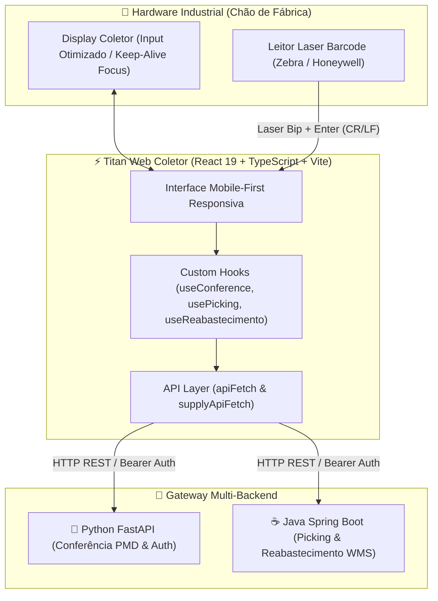

<p align="center">
  
</p>

<h1 align="center">Titan Web Coletor</h1>

<p align="center">
  <b>Interface Web de Alta Performance para Coletores de Dados Industriais (WMS / Indústria 4.0)</b>
</p>

<p align="center">
  
  
  
  
  
  
</p>

---

## 📌 Visão Geral do Projeto

O **Titan Web Coletor** é um sistema frontend de missão crítica projetado e construído especificamente para operação em **coletores de dados industriais** (handhelds robustos Zebra, Honeywell e Datalogic com leitores laser de código de barras integrados).

O sistema opera no chão de fábrica e galpões logísticos, atuando como interface em tempo real para dois pilares operacionais estratégicos:

1. 🌿 **Conferência PMD (Processamento de Tabaco)**: Validação de lotes e rastreabilidade de caixas/materiais de produção agrícola/industrial em lote.
2. 📦 **Gestão de Abastecimento WMS (Picking & Reabastecimento)**: Operação contínua de picking de paletes (*Storage Units - SU*), transferência para buffers e reabastecimento de módulos industriais.

---

## 🎯 Engenharia para Hardware Industrial (Key Engineering Highlights)

Dispositivos coletores industriais possuem limitações severas de hardware: telas ultra-compactas (320px a 480px), CPUs de baixo consumo, ausência de ponteiro/mouse e necessidade de **tempo de resposta zero** para operadores em ritmo acelerado de produção.

Para superar esses desafios, o **Titan Web Coletor** foi projetado com os seguintes padrões de engenharia:

### 1. 🚫 Bloqueio de Teclado Virtual (`inputmode="none"`)
Previne a abertura indesejada do teclado virtual do sistema operacional (Android / Windows CE) ao focar nos campos de entrada. Isso evita *layout shifts*, mantém 100% da viewport visível e elimina a necessidade de toques na tela.

### 2. 🎯 Keep-Alive Focus Engine (Foco Ininterrupto)
Através de Custom Hooks reutilizáveis (`useConference`, `usePicking`, `useReabastecimento`), a aplicação monitora continuamente a perda de foco (`blur`) e força a manutenção do foco no campo de leitura ativo após cada disparo do laser.

### 3. ⚡ Hardware Trigger Integration (CR/LF EOL Parsing)
Tratamento nativo para caracteres de término (`Enter`/`Carriage Return`) enviados pelos leitores laser industriais, permitindo a submissão instantânea dos dados sem necessidade de cliques na tela.

### 4. 🔄 Normalização Resiliente de Payloads Backend (`parseClaimResponse`)
Camada de adaptação no frontend que aceita múltiplas estruturas de payload (camelCase, snake_case e aliases em Português/Inglês) vindas de microsserviços legados ou heterogêneos, garantindo tolerância a falhas na integração API.

### 5. 🐳 Injeção Dinâmica de Variáveis de Ambiente (12-Factor App)
A imagem Docker realiza a injeção em runtime das URLs de backend (`window.__ENV__`) via script de entrada (`docker-entrypoint.sh`). Isso permite reutilizar o **mesmo artefato compresso (imagem Docker)** em ambientes de Desenvolvimento, Homologação e Produção alterando apenas as variáveis de contêiner.

### 6. 🔗 Gateway HTTP de Alta Disponibilidade com Multi-Backend
Camada HTTP unificada com suporte a múltiplos gateways:
- **FastAPI (Python)**: Microsserviço de autenticação e conferência PMD.
- **Spring Boot (Java)**: Microsserviço de gestão de picking e abastecimento WMS.
- **Resiliência Integrada**: `AbortController` nativo com timeout de 10s, expiração automática de sessão (HTTP 401) e tratamento de erros de rede sem travamento de tela.

---

## 🏗️ Arquitetura do Sistema



---

## 🚀 Módulos e Fluxos da Aplicação

### 🌿 1. Conferência PMD (Tabaco)
- **Seleção de Ordens**: Consulta de ordens de produção ativas com indicador de progresso e itens pendentes (`PmdOrders.tsx`).
- **Validação de Código/Lote**: Tratamento e padronização automática de códigos lidos (`10...`), identificando divergências ou duplicidades em tempo real.
- **Auto-Scroll e Feedback Visual**: Rolagem automática para o próximo item pendente e sinalização sonora/visual instantânea de sucesso ou erro.

### 📦 2. Gestão de Picking WMS
- **Fila de Tarefas Dinâmica**: Consulta e reserva de ordens via `POST /supply/claim`.
- **Máquina de Estados de Picking**:
  - **`CLAIMED`**: O operador lê o código do Palete/SU (`POST /supply/picking`).
  - **`PICKING`**: O operador lê a posição/local de buffer de destino (`POST /supply/place-in-buffer`).
- **Continuous Flow**: Após a confirmação do local de buffer, a aplicação busca automaticamente a próxima tarefa sem atrasos ou navegações manuais.

### 🏭 3. Reabastecimento de Módulos
- **Consulta por Palete**: Leitura do código SU do palete (`POST /supply/pick-refueling/{su}`).
- **Direcionamento de Módulo**: Exibição destacada do Módulo Industrial de destino.
- **Confirmação de Abastecimento**: Confirmação da entrega via `POST /supply/supply-material`.

---

## 🛠️ Tecnologias Utilizadas

| Categoria | Tecnologia | Descrição |
| :--- | :--- | :--- |
| **Core** | [React 19](https://react.dev/) | Biblioteca UI de última geração com hooks otimizados |
| **Linguagem** | [TypeScript 5.9](https://www.typescriptlang.org/) | Tipagem estática rigorosa para prevenção de erros em runtime |
| **Build Tool** | [Vite 7](https://vitejs.dev/) | HMR ultra-rápido e bundles otimizados para produção |
| **Roteamento** | [React Router v7](https://reactrouter.com/) | Roteamento declarativo de alta performance |
| **Containerização** | [Docker](https://www.docker.com/) | Build multi-stage (Node 22 Alpine + `serve`) |
| **Configuração** | 12-Factor App | Variáveis em tempo de execução via `docker-entrypoint.sh` |
| **Estilização** | Vanilla CSS | Layouts responsivos e flexíveis sem overhead de runtime |
| **Linter/Quality** | [ESLint 9](https://eslint.org/) | Regras de código e boas práticas de React Hooks |

---

## 📂 Arquitetura de Pastas

```
Titan-Web-Coletor/
├── public/                 # Favicon e assets estáticos
├── src/
│   ├── components/         # Componentes UI encapsulados (ConferenceItem, OrderListItem)
│   ├── hooks/              # Lógica de negócio, estado da UI e Keep-Alive Focus Engine
│   │   ├── useConference.ts
│   │   ├── useLogin.ts
│   │   ├── useOrders.ts
│   │   ├── usePicking.ts
│   │   └── useReabastecimento.ts
│   ├── pages/              # Telas da aplicação (Login, Dashboard, Conference, Picking, etc.)
│   ├── routes/             # Definições de rotas com React Router v7
│   ├── services/           # Cliente HTTP resiliente, autenticação e gerenciamento de tokens
│   │   ├── api.ts
│   │   └── auth.ts
│   ├── utils/              # Auxiliares de formatação e parsing
│   │   └── format.ts
│   ├── App.tsx             # Componente raiz
│   └── main.tsx            # Ponto de entrada da aplicação
├── docker-entrypoint.sh    # Injeção de variáveis de ambiente no container em tempo de execução
├── docker-compose.yml      # Configuração para execução local via containers
├── Dockerfile              # Build otimizado em 2 estágios (Multi-Stage)
└── package.json            # Dependências e scripts
```

---

## ⚙️ Variáveis de Ambiente

Crie um arquivo `.env` na raiz do projeto baseado no `.env.example`:

```env
# URL da API Principal (FastAPI - Conferência PMD / Autenticação)
VITE_API_URL=http://localhost:25566

# URL da API de Abastecimento (Spring Boot - Picking / Reabastecimento WMS)
VITE_SUPPLY_API_URL=http://localhost:8081
```

---

## 💻 Instalação e Execução

### 1. Desenvolvimento Local

```bash
# 1. Instalar as dependências do projeto
npm install

# 2. Executar o servidor de desenvolvimento (porta 3001)
npm run dev

# 3. Validar tipagem TypeScript e realizar build de produção
npm run build
```

Acesse a aplicação em `http://localhost:3001`.

### 2. Execução com Docker (Recomendado para Produção)

#### Via Docker Compose
```bash
docker compose up -d --build
```

#### Via Docker CLI (Com Injeção Dinâmica de Variáveis)
```bash
# Build da imagem Docker
docker build -t titan-web-coletor .

# Execução do container configurando as URLs do backend em runtime
docker run -d \
  -p 3001:80 \
  -e VITE_API_URL=http://localhost:25566 \
  -e VITE_SUPPLY_API_URL=http://localhost:8081 \
  --name titan-web-coletor \
  titan-web-coletor
```

---

## 💎 Qualidade de Código e Boas Práticas

- **Zero Type Ambiguity**: Uso rigoroso de interfaces e generics no TypeScript 5.9, evitando o tipo `any`.
- **Desempenho Otimizado**: Re-renderizações minimizadas através do uso estratégico de `useMemo`, `useCallback` e `useRef`.
- **Resiliência a Desconexões**: Timeout com `AbortController`, reconexão automática e tratamento amigável de falhas de rede.
- **Padrão 12-Factor App**: Total desvinculação entre código e configurações de infraestrutura.
