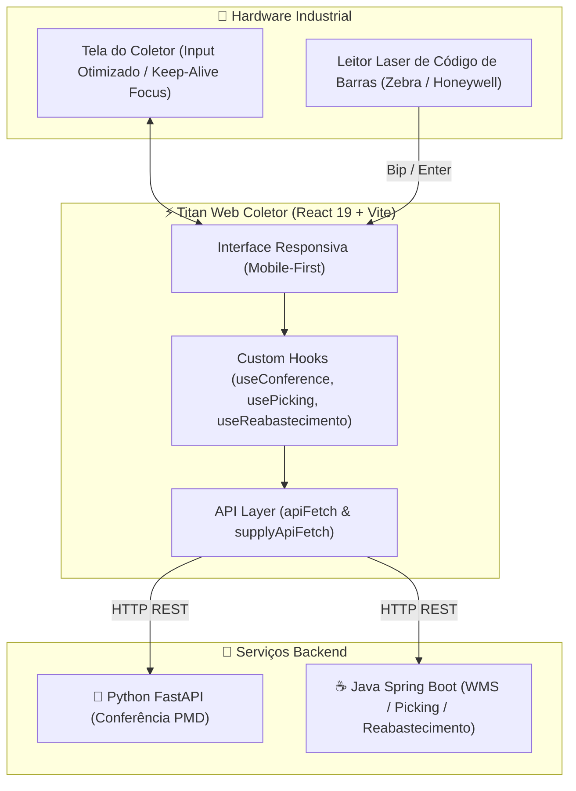

<p align="center">
  
</p>

<h1 align="center">Titan Web Coletor</h1>

<p align="center">
  <b>Interface Web de Alta Performance para Coletores de Dados Industriais (WMS / Logística)</b>
</p>

<p align="center">
  
  
  
  
  
</p>

---

## 📌 Sobre o Projeto

O **Titan Web Coletor** é um sistema frontend especialista desenvolvido sob medida para operação em **coletores de dados industriais** (equipamentos portáteis e robustos com leitor de código de barras a laser Zebra, Honeywell, Datalogic).

Construído com **React 19**, **TypeScript** e **Vite**, o projeto atua como a interface operacional de chão de fábrica para processos estratégicos da cadeia logística e industrial:
1. **Conferência de Tabaco (PMD)** – Validação de lotes e códigos de materiais via scanner em lote de ordens de produção.
2. **Operações de Abastecimento e Picking (WMS)** – Fluxo contínuo de picking com buffer e reabastecimento de módulos industriais via palete (Storage Units - SU).

---

## 🎯 Diferenciais Técnicos e Arquitetura para Hardware Industrial

Dispositivos coletores de dados possuem restrições severas de hardware (telas reduzidas de 320px a 480px de largura, ausência de mouse e necessidade de velocidade máxima no processamento). O Titan Web Coletor foi arquitetado com padrões específicos para superar essas limitações:

- 🚫 **Bloqueio de Teclado Virtual (`inputmode="none"`)**: Impede a abertura indesejada do teclado touch nativo do SO (Android/Windows CE), preservando a área útil da tela e evitando distrações operacionais.
- 🎯 **Foco Contínuo Ininterrupto (Keep-Alive Focus Engine)**: Custom hooks que monitoram o evento `blur` e restauram automaticamente o foco no campo de leitura após cada bip do laser.
- ⚡ **Processamento via Hardware Trigger (Enter Key)**: Suporte nativo aos caracteres de término `CR`/`LF` de leitores laser industriais para submissão instantânea de dados sem clique em botões.
- 🐳 **Injeção de Variáveis em Tempo de Execução (12-Factor App)**: O contêiner Docker injeta as URLs de API em runtime (`window.__ENV__`) via `docker-entrypoint.sh`. Isso permite reutilizar a mesma imagem Docker em dev, staging e produção alterando apenas variáveis de ambiente.
- 🔗 **Arquitetura Multi-Backend (Dual API Gateway)**:
  - **FastAPI (Python)**: Microsserviço responsável pela conferência PMD.
  - **Spring Boot (Java)**: Microsserviço responsável pela gestão de picking e abastecimento WMS.

---

## 🏗️ Arquitetura do Sistema



---

## 🚀 Funcionalidades Principais

### 🚜 1. PMD (Conferência de Tabaco)
- **Ordens de Conferência**: Listagem e seleção de ordens de produção ativas (`PmdOrders.tsx`).
- **Validação de Materiais**: Leitura com leitor laser e validação instantânea de lote (`10...`) e código do material.
- **Feedback HÁPTICO/VISUAL**: Animações visuais de confirmação verde e tratamento sonoro/visual claro para divergências.

### 📦 2. Gestão de Abastecimento (WMS)
- **Picking Automatizado**:
  - Consulta dinâmica de tarefas via fila prioritária (`POST /supply/claim`).
  - Ciclo de estados resiliente:
    - **`CLAIMED`**: Leitura e validação de Palete/SU (`POST /supply/picking`).
    - **`PICKING`**: Leitura de Posição / Local de buffer (`POST /supply/place-in-buffer`).
  - Recarregamento automático do ciclo contínuo de picking.
- **Reabastecimento de Módulos**:
  - Consulta do SU do palete (`POST /supply/pick-refueling/{su}`).
  - Apresentação em destaque do Módulo de Destino.
  - Confirmação de abastecimento por módulo (`POST /supply/supply-material`).

---

## 📁 Estrutura do Projeto

```
Titan-Web-Coletor/
├── public/                 # Favicon e arquivos estáticos
├── src/
│   ├── components/         # Componentes UI reutilizáveis (OrderListItem, etc.)
│   ├── hooks/              # Custom Hooks com a lógica de negócio e foco contínuo
│   │   ├── useConference.ts
│   │   ├── usePicking.ts
│   │   └── useReabastecimento.ts
│   ├── pages/              # Visualizações principais (Dashboard, Conference, Picking, etc.)
│   ├── routes/             # Roteamento centralizado (React Router v7)
│   ├── services/           # Camada REST (apiFetch, supplyApiFetch, token manager)
│   └── utils/              # Funções utilitárias e formatadores
├── docker-entrypoint.sh    # Injeção de variáveis de ambiente em tempo de execução
├── docker-compose.yml      # Orquestração local de contêineres
├── Dockerfile              # Build multi-stage (Node 22 Alpine + Serve)
└── package.json            # Dependências e scripts do projeto
```

---

## ⚙️ Variáveis de Ambiente

Crie um arquivo `.env` na raiz do projeto com base no `.env.example`:

```env
# API Principal (FastAPI - Conferência PMD / Autenticação)
VITE_API_URL=http://localhost:25566

# API de Abastecimento (Spring Boot - Picking / Reabastecimento WMS)
VITE_SUPPLY_API_URL=http://localhost:8081
```

---

## 🛠️ Instalação e Execução

### 1. Desenvolvimento Local

```bash
# 1. Instalar dependências
npm install

# 2. Iniciar servidor de desenvolvimento (porta 3001)
npm run dev

# 3. Compilar e checar tipos TypeScript
npm run build
```

A aplicação estará acessível em `http://localhost:3001`.

### 2. Execução com Docker

#### Usando Docker Compose (Recomendado)
```bash
docker compose up -d --build
```

#### Usando Docker diretamente
```bash
# Compilar a imagem Docker
docker build -t titan-web-coletor .

# Executar o contêiner com variáveis de ambiente dinâmicas
docker run -d \
  -p 3001:80 \
  -e VITE_API_URL=http://localhost:25566 \
  -e VITE_SUPPLY_API_URL=http://localhost:8081 \
  --name titan-web-coletor \
  titan-web-coletor
```

---

## 💎 Boas Práticas e Engenharia de Software

- **Strict Type Safety**: Tipagem completa com TypeScript 5.9 sem uso de `any`.
- **Resiliência e Timeouts**: Camada HTTP com `AbortController` (timeout padrão de 10s), limpeza automática de tokens expirados (401) e mensagens amigáveis em falhas de rede.
- **Desenvolvimento Otimizado**: Vite 7 para HMR ultra-rápido e builds enxutos.
- **12-Factor App Compliance**: Separação estrita de configuração e código, habilitando deploys imutáveis via Docker.
